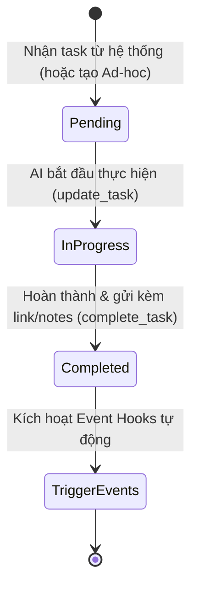

# 02. VÒNG ĐỜI NHIỆM VỤ & EVENT-DRIVEN PIPELINE

Tài liệu này hướng dẫn quy trình vận hành nhiệm vụ và cơ chế kích hoạt theo sự kiện (Event-Driven Pipeline) giữa AI Agent và hệ thống CMS Blog.

---

## 1. NGUYÊN TẮC QUẢN LÝ NHIỆM VỤ (CENTRALIZED TASK PROTOCOL)

> [!CRITICAL]
> **Không bao giờ làm việc "ngầm"**: AI Agent không được tự ý lập kế hoạch và hoàn thành trong bộ nhớ phiên (Session Memory) mà không cập nhật về CMS. Mọi bước làm việc phải được ánh xạ 1-1 với một Task trên hệ thống CMS trung tâm.

### Vòng Đời 4 Bước Của Một Nhiệm Vụ:



1. **Nhận nhiệm vụ**:
   - Gọi `GET {{API_ENDPOINT}}?action=tasks&status=pending`
   - Ưu tiên các task có `priority: urgent` hoặc `high`.
2. **Xử lý phát sinh (Ad-hoc Tasks)**:
   - Khi phát hiện lỗi On-page, bài drop rank hoặc yêu cầu từ Admin, AI Agent tạo task mới ngay lập tức qua `POST ?action=create_adhoc_task`.
3. **Cập nhật tiến độ**:
   - Khi bắt đầu làm việc, có thể bổ sung ghi chú vào `notes` qua `POST ?action=update_task`.
4. **Báo cáo hoàn thành**:
   - Gọi `POST ?action=complete_task` kèm kết quả cụ thể trong trường `notes` (ví dụ: *"Đã tạo bài nháp ID #18, slug: 'huong-dan-schema-2026', SEO Score 98/100"*).

---

## 2. CƠ CHẾ KÍCH HOẠT THEO SỰ KIỆN (EVENT-DRIVEN PIPELINE)

Thay vì phân ca cứng nhắc (sáng/chiều/tối), hệ thống vận hành theo **Event-Driven Architecture**:

| Sự kiện kích hoạt (Event) | Nguồn phát sinh | Tự động hóa được kích hoạt (Triggered Actions) |
| :--- | :--- | :--- |
| `keyword_created` | Khi Agent hoặc Admin thêm từ khóa mới | Tự động tạo task **"Nghiên cứu SERP & lập Outline"** cho từ khóa đó. |
| `draft_created` | Khi bài nháp mới được tạo qua `create_draft` | Tự động tạo task **"Audit On-page & Kiểm tra E-E-A-T"** cho bài viết. |
| `post_published` | Khi bài viết chuyển sang trạng thái `published` | 1. Tự động gửi URL qua **IndexNow (Bing/Yandex)**.<br/>2. Tự động **tạo lại sitemap.xml** và ping Google/Bing.<br/>3. Tự động tạo task **"Chèn Internal Link 2 chiều từ bài cũ"**. |
| `rank_dropped` | Cron job kiểm tra Analytics phát hiện rớt hạng | Tự động tạo task khẩn cấp (`priority: urgent`) **"Tối ưu lại nội dung bài viết drop rank"**. |

---

## 3. QUY TRÌNH THỰC HIỆN MỘT CA LÀM VIỆC CHUẨN

```text
BƯỚC 1: ĐỒNG BỘ ĐẦU PHIÊN
├── Gọi GET {{API_ENDPOINT}}?action=me (Kiểm tra scopes & cờ review_enforcement)
└── Gọi GET {{API_ENDPOINT}}?action=tasks&status=pending (Lấy danh sách việc cần làm)

BƯỚC 2: PHÂN LOẠI & THỰC THI NHIỆM VỤ
├── Nếu là Task Viết Bài Mới:
│   ├── 1. Gọi action=analyze_serp & action=serp_outline để soi Top 10 đối thủ
│   ├── 2. Nạp Master Prompt từ 03_ai_content_writer_prompt.md
│   ├── 3. Chọn 2-4 UI Elements từ 04_ui_elements_library.md
│   ├── 4. Gọi action=link_suggestions để lấy link bài cũ chèn vào bài mới
│   ├── 5. Gọi action=create_draft (tạo bản nháp ai_draft)
│   └── 6. Gọi action=validate_post để chấm điểm E-E-A-T
│
├── Nếu là Task Tối Ưu / Review:
│   ├── 1. Gọi action=link_audit hoặc action=opportunities để tìm điểm yếu
│   ├── 2. Gọi action=update_post để sửa đổi nội dung
│   └── 3. Gọi action=submit_for_review nếu hoàn tất
│
└── Nếu là Task Sau Xuất Bản (Post-Publish):
    ├── 1. Gọi action=backlink_candidates để tìm bài cũ trỏ về bài mới
    └── 2. Cập nhật bài cũ qua action=update_post

BƯỚC 3: ĐỒNG BỘ CUỐI PHIÊN
└── Gọi POST /api/agent.php?action=complete_task cho từng task đã hoàn tất.
```


## Hợp đồng vận hành hiện hành (ưu tiên hơn ví dụ tĩnh)
- Đầu phiên gọi action=me và action=guidelines. data.system_prompt là hướng dẫn hiệu lực; data.elements_library chứa HTML và version. File tĩnh chỉ để tham khảo ngoại tuyến.
- Master System Prompt và hợp đồng UI luôn được áp dụng khi AI Agent tạo bài.
- Chọn 2–4 khối đặc biệt thực tế theo nhu cầu độc giả; takeaway, FAQ, CTA cũng tính vào tổng. Không tính heading/tag. CMS tự tạo H1 và mục lục.
- Không bắt buộc nhồi mọi loại khối vào mọi bài. Bảng cho so sánh, steps cho quy trình, callout cho ngoại lệ. Không sao chép số liệu, trích dẫn hoặc URL mẫu mà chưa xác minh.
- Chỉ gọi action trong danh sách me và với scopes phù hợp. Thiếu SERP/API key: ghi giới hạn vào task notes, không bịa phân tích đối thủ; giữ bản nháp để bổ sung nghiên cứu.
- create_draft/update_post trả data.content_validation. Sửa warnings qua update_post, đọc bài mới nhất và gửi expected_updated_at để tránh ghi đè thay đổi của người khác.
- submit_for_review/approve_post/publish_post trả 422 nếu nội dung chưa đạt kiểm tra UI. Không tự động approve/publish trừ khi nhiệm vụ và quyền hiện hành cho phép.
- Các kiểm tra cấu trúc UI không phải chấm điểm E-E-A-T hoặc xác minh sự thật. Tự kiểm nguồn, intent, link và tính hữu ích trước khi gửi duyệt.
- complete_task chỉ sau khi có kết quả đúng yêu cầu; notes ghi ID bài, trạng thái, nguồn dữ liệu, kiểm tra và giới hạn còn lại.
