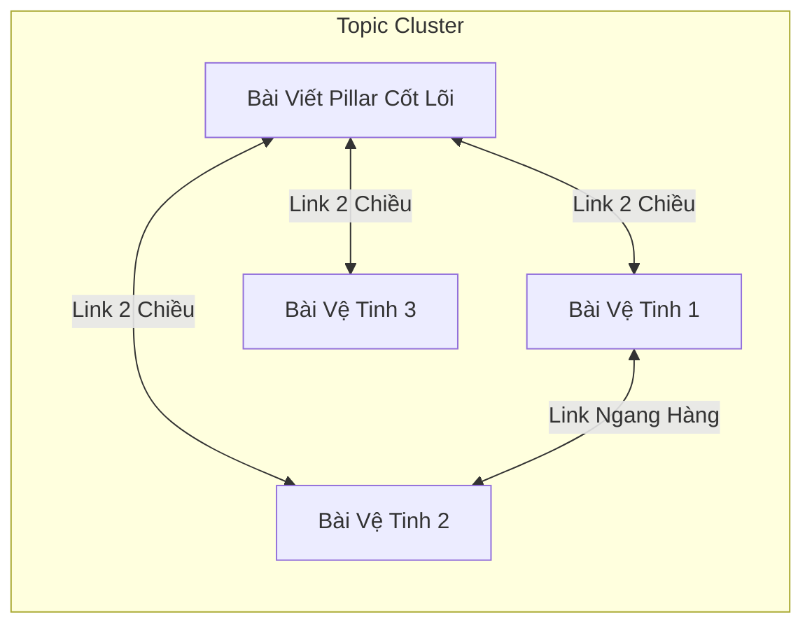

# 06. INTERNAL LINKING 2 CHIỀU & ADVANCED SCHEMA JSON-LD

Tài liệu này hướng dẫn chiến lược liên kết nội bộ 2 chiều (Bidirectional Linking) và tích hợp Dữ liệu có cấu trúc Schema.org JSON-LD nâng cao.

---

## 1. CHIẾN LƯỢC INTERNAL LINKING 2 CHIỀU

Liên kết nội bộ giúp dàn đều sức mạnh PageRank (Link Juice) và giúp Google bot hiểu cấu trúc Silo/Topic Cluster của website.



### Chiều 1: Bài Mới $\rightarrow$ Bài Cũ (Outbound Link)
Khi viết bài mới, AI gọi API để lấy danh sách bài viết liên quan có sẵn trên website:

```http
POST {{API_ENDPOINT}}?action=link_suggestions
Content-Type: application/json
Authorization: Bearer <TOKEN>

{
  "keyword": "tối ưu on-page seo",
  "limit": 5
}
```

* **Dữ liệu trả về**: Danh sách bài viết kèm `url`, `title`, `suggested_anchor_text`, `relevance_score`.
* **Hành động**: Chèn 2–4 liên kết này vào thân bài mới bằng anchor text tự nhiên.

---

### Chiều 2: Bài Cũ $\rightarrow$ Bài Mới (Inbound Link - Chống Orphan Page)
Sau khi bài mới được xuất bản, để tránh trang bị cô lập (Trang mồ côi - Orphan Page), AI gọi API để tìm các bài cũ cần chèn link trỏ về:

```http
POST {{API_ENDPOINT}}?action=backlink_candidates
Content-Type: application/json
Authorization: Bearer <TOKEN>

{
  "post_id": 15
}
```

* **Dữ liệu trả về**: Danh sách bài viết cũ kèm `insertion_context` (đoạn văn gợi ý vị trí chèn link).
* **Hành động**: Dùng API `update_post` để chèn link trỏ về bài mới ID #15.

---

### Audit Toàn Diện Liên Kết Nội Bộ (`action=link_audit`)
Gọi `GET {{API_ENDPOINT}}?action=link_audit` để phát hiện:
- `orphan_pages`: Danh sách trang mồ côi (0 inbound links).
- `under_linked_pages`: Trang có 0 outbound links.
- `over_linked_pages`: Trang có hơn 15 links (nguy cơ loãng link juice).

---

## 2. SCHEMA MARKUP JSON-LD NÂNG CAO

Google ưu tiên đọc Schema JSON-LD được nhúng trong thẻ `<script type="application/ld+json">`.

Hệ thống hỗ trợ trường `custom_schema_json` trong API `create_draft` và `update_post`.

### Ví Dụ 1: Schema FAQPage (Hỏi Đáp)
```json
{
  "@type": "FAQPage",
  "mainEntity": [
    {
      "@type": "Question",
      "name": "On-Page SEO mất bao lâu để thấy hiệu quả?",
      "acceptedAnswer": {
        "@type": "Answer",
        "text": "Thông thường sau khi tối ưu và index lại, thứ hạng từ khóa sẽ có chuyển biến rõ rệt sau 2 đến 6 tuần tùy mức độ cạnh tranh."
      }
    },
    {
      "@type": "Question",
      "name": "Nên tối ưu On-Page trước hay làm Backlink trước?",
      "acceptedAnswer": {
        "@type": "Answer",
        "text": "Luôn luôn tối ưu On-Page và cấu trúc nội dung thật chuẩn trước khi bắt đầu xây dựng Backlink."
      }
    }
  ]
}
```

### Ví Dụ 2: Schema HowTo (Hướng Dẫn Từng Bước)
```json
{
  "@type": "HowTo",
  "name": "Quy trình 3 bước tối ưu On-Page với AI Agent",
  "step": [
    {
      "@type": "HowToStep",
      "position": 1,
      "name": "Phân tích SERP đối thủ",
      "text": "Sử dụng API analyze_serp để lấy danh sách thẻ H2/H3 của Top 10 đối thủ."
    },
    {
      "@type": "HowToStep",
      "position": 2,
      "name": "Sản xuất nội dung chuẩn E-E-A-T",
      "text": "Viết bài theo mô hình PAS kết hợp các khối UI Elements chuẩn."
    },
    {
      "@type": "HowToStep",
      "position": 3,
      "name": "Gửi chỉ mục IndexNow",
      "text": "Kích hoạt API ping_index để thông báo cho Bing, Yandex và Google."
    }
  ]
}
```

> [!TIP]
> **Tự Động Trích Xuất FAQ**: Hệ thống CMS tự động quét các thẻ `<details><summary>` trong nội dung bài viết và tự động ghép vào Schema JSON-LD trang mà Agent không cần truyền tay nếu đã dùng đúng UI Accordion.
